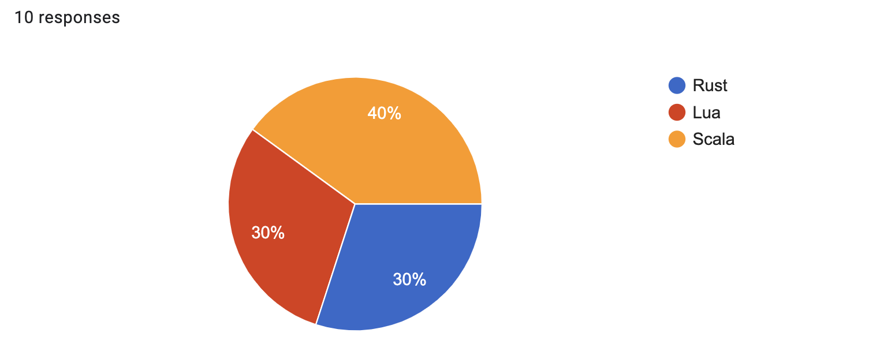
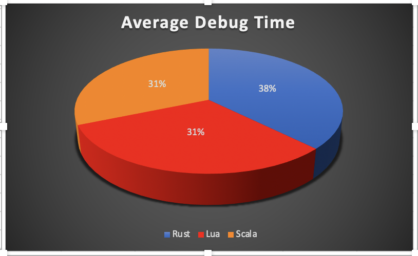
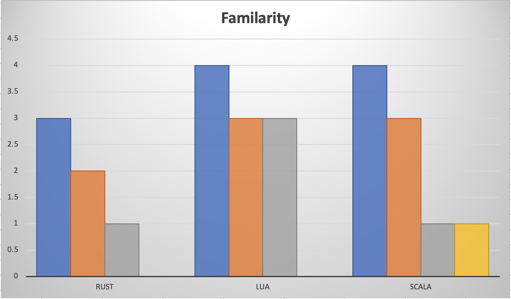
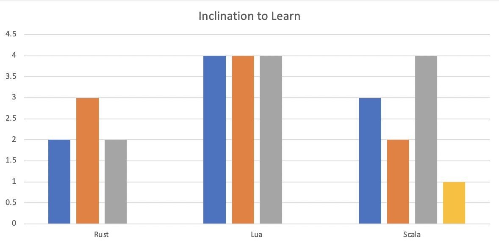

## Technologies Used
1. Google forms to collect the data
2. Zoom video for observation and interactions
3. Excel Sheet to note down the observations
4. Repl.it to execute the code

## Data Collection
#### Google forms
1. Number of Bugs Found
2. Number of Bugs Fixed
3. Difficulty in understanding the language (1-5)
4. Inclination to learn particular langugae in future (1-5)

#### Observations
1. Time taken to debug
2. Familiarity with langugae (1-5)

## Results

#### Language choosen

#### Average time taken to Debug

#### Familarity Score

#### Inclination Score

## Conclusion
Looking at the data we have collected, we came to conclude that "Lua" is the easiest language to debug and people were more familair with the logic/language after debugging it. Also, people were more inclined to learn "Lua" compared to other langugae.  
 
 
## Threats To Validty 

During this experiment, we have observed five main threats to our validity. 
   
When we conducted unit testing on all our 3 languages, we didn’t granularize to the operations being performed in each iteration. This may mean that there is some difference in our executions for the intra-generation operations between the three languages.
   
We also didn’t conduct research into the parameters used conducting a coding experiment with human subjects. The parameters we used while taking notes: Time taken to debug, Number of bugs found, Number of bus fixed; these were based on our experience, thus are subjective.
   
When testing with our subjects, we did not flesh out a standard for the notes being taken. Some of us recorded the exact time a subject changed a line in their code while others recorded the time when they ran the code. Using automation to do this would have made this process much smoother and given the experiment more validity.  
   
Our use of google forms to attain the information from the subject made our data points more subjective than if we were to use standardized notes.
   
We also didn’t provide the subjects with any test cases. They only had one input to debug the code and they didn’t know what the output should look like. This may have been the reason behind some people taking longer to debug. It would mean that the values for time taken are skewed.

